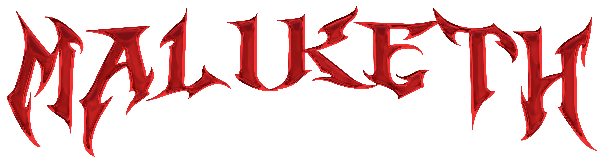

<!-- Centered logo -->

  

# Maliketh

Maliketh is a multi-user, customizable C2 framework. The goal of Maliketh is to provide a flexible, easy to use C2 framework that can be customized to fit the needs of the operator. The poster used in the initial presentation is located [here](./data/Maliketh%20C2%20Poster.png).

## Implant features

The implant is written in C++ and targeted for Windows. The main feature of the implant is its ability to change its behavior based on the configuration file it receives from the server. This allows the operator to customize the implant to fit their needs. The implant also has the following features (see [here](./design/opcodes.md) for more info):

* File upload/download
* Command execution
* Shellcode injection
* Update configuration
* Send system information
* Self-destruct
* Sleep
* Basic Anti-debugging
* *Very* Basic Anti-VM
* Sleep skipping detection

## Future work

- [ ] Implement Golang client
* [x] Per-operator builder in-server ([917d514](https://github.com/cbrnrd/maliketh/commit/917d514fc6075cc15d0e45b4a1a546e6217e4139))
* [ ] Stealer/basic looter
* [ ] Keylogger
* [ ] Route RabbitMQ traffic through Admin listener instead of directly connecting
* [ ] Improved anti-vm (check BIOS information)
* [x] More stable file uploads/downloads ([91a40f2](https://github.com/cbrnrd/maliketh/commit/91a40f2ba1cded5a025004a6143578fa84baec66))
* [ ] Alternate C2 channels (WireGuard, DNS, Discord, Slack, etc.)
* [x] Basic OS functions built in ([91a40f2](https://github.com/cbrnrd/maliketh/commit/91a40f2ba1cded5a025004a6143578fa84baec66))
* [x] Situational Awareness ([91a40f2](https://github.com/cbrnrd/maliketh/commit/91a40f2ba1cded5a025004a6143578fa84baec66))
